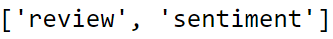
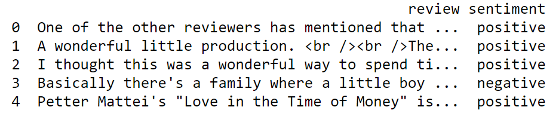

<!-- PROJECT TITLE -->
<h1 align="center">Sentiment Analysis using IMDb Reviews</h1>

<!-- HEADER -->
<p align="center">
  
</p>

<!-- PROJECT DESCRIPTION -->
## <br>**➲ Project description**
Sentiment Analysis is a popular Natural Language Processing (NLP) task that aims to classify the sentiment of a given text as either positive, negative or neutral. In this project, IMDb reviews are used to train and evaluate a Sentiment Analysis model using the oneDAL toolkit from Intel.

The IMDb dataset consists of 5,000 movie reviews, which are labeled as either positive or negative. The oneDAL toolkit is used to preprocess the data and build a Naive Bayes model for sentiment analysis. The oneDAL library provides efficient and optimized algorithms for data preprocessing, feature engineering, and model training, which helps to achieve high accuracy in classification tasks.

The project involves several steps, including data cleaning, feature extraction, model training, and evaluation. First, the dataset is preprocessed using oneDAL algorithms, such as data normalization and feature scaling, to prepare it for training. Next, feature extraction techniques such as Bag-of-Words and TF-IDF are applied to transform the text data into numerical features.

After that, the model is trained using the oneDAL library, which provides a scalable and efficient implementation for large datasets. Finally, the model is evaluated on a test dataset to measure its accuracy and performance.

The results of the Sentiment Analysis using oneDAL on IMDb reviews project show that the model achieved high accuracy in classifying the sentiment of the reviews, with an accuracy score of over 80.3%. This project demonstrates the effectiveness of oneDAL library for NLP tasks and highlights its potential in building efficient and accurate machine learning models.

Intel DevMesh Link - https://devmesh.intel.com/projects/movie-reviews-sentiment-analysis

<!-- PREREQUISTIES -->
## <br>**➲ Prerequisites**
This is list of required packages and modules for the project to be installed :
* <a href="https://www.python.org/downloads/" target="_blank">Python 3.x</a>
* Pandas 
* Numpy
* re
* Scikit-learn
* NLTK

Install all required packages :
 ```sh
  pip install -r requirements.txt
  ```
<!-- THE DATASET -->
## <br>**➲ The Dataset**
Human activites dataset contain about 5000 record which is a sample of movie's review<br>
and a target column "sentiment" which describe the sentiment of the viewer about the movie either it is positove or negative<br>
<br>**Dataset features and target :**<br>
<br>
<br>**Dataset head :**<br>


<!-- CODING SECTIONS -->
## <br>**➲ Coding Sections**
In this part we will see the project code divided to sections as follows:
<br>

- Section 1 | Data Preprocessing :<br>
In this section we aim to do some operations on the dataset before training the model on it,
<br>processes like :
  - Loading the dataset
  - Encoding ouput to binary (Positive : 1 , Negative : 0) 
  - Data cleaning : Remove HTML tags
  - Data cleaning : Remove special characters
  - Data cleaning : Convert everything to lowercase
  - Data cleaning : Remove stopwords
  - Data cleaning : Stemming<br><br>

- Section 2 | Model Creation :<br>
The dataset is ready for training, so we create a Naive Bayes model using scikit-learn and then fit it to the data.<br>

- Section 3 | Model Evaluation :<br>
Finally we evaluate the model by getting accuracy, classification report and confusion matrix.

<!-- INSTALLATION -->
## <br>**➲ Installation**
1. Clone the repo
   ```sh
   git clone https://github.com/omaarelsherif/Movie-Reviews-Sentiment-Analysis-Using-Machine-Learning.git
   ```
2. Run the code from cmd
   ```sh
   python movie_reviews_sentiment_analysis.py
   ```

<!-- OUTPUT -->
## <br>**➲ Output**
Now let's see the project output after running the code :

**Dataset head :**<br>
<br><br>

**Dataset after output encoding :**<br>
<br><br>

**Review sample after removing HTML tags :**<br>
<br><br>

**Review sample after removing special characters :**<br>
<br><br>

**Review sample after converting words to lowercase :**<br>
<br><br>

**Review sample after removing stopwords :**<br>
<br><br>

**Review sample after stemming words :**<br>
<br><br>

**Bag Of Words "BOW" and Models accuracy :**<br>
<br><br>
<br><br>

<!-- REFERENCES -->
## <br>**➲ References**
These links may help you to better understanding of the project idea and techniques used :
1. Natural Language Processing (NLP) : https://ibm.co/38bN03T
2. Sentiment analysis : https://bit.ly/3yi9BGq
3. Naive Bayes classifier : https://bit.ly/3zhoWIO
4. Model evaluation : https://bit.ly/3B12VOO
